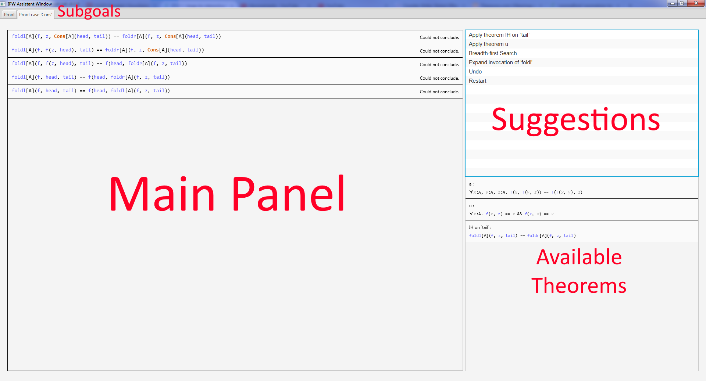

# IPW
Interactive Proof Assistant for [Welder](https://github.com/epfl-lara/welder), the project I developed in the context of LARA's Synthesis, Analysis and Verification course.

## Usage

Compilation should be straightforward except that both Welder and Inox should be published locally.

Once compilation is successful, you can play with the `Main.scala` at the root of the source folder.

## Manual

Run `Main.scala` and the assistant window should show up.

1. **Main Panel** is where the state of the proof is shown at each step.
2. **Suggestions** list shows all the suggestion that are available at the current step. Select one to update the proof. If the suggestion can be applied to several subexpressions, you will have to pick one directly in the main panel (subexpressions that cannot be selected became gray).
3. **Available Theorems** is simply a list of the theorems that are available and are taken into account by the analyser. No interaction is involved with this panel.
4. **Subgoals** can be switched by selected the desired tab. A proof is complete when all the subgoals are proven. Subgoals are typically generated when doing structural induction, or when the current subgoal is of the form `G1 && ... && Gn` in which case there will be `n` subgoals generated.

A few tips:

* It is generally not a good idea to try Breadth-first search unless the proof is almost complete or rather simple. Or be ready to wait...
* You can close the assistant at any point and the state of the proof will be saved to the given file, so that you can find it in the same state as you left it.
* You don't have to call `IPWprove` on the whole expression to prove. If it is too complex, you can start the proof in Welder and call IPWprove and simpler parts.